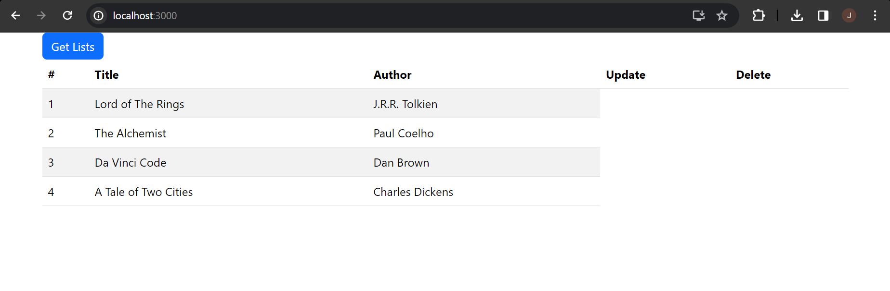
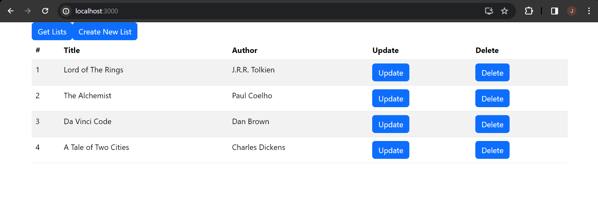
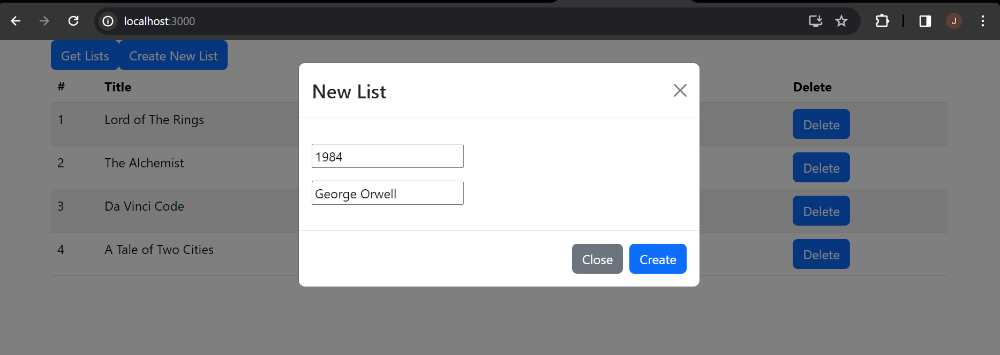
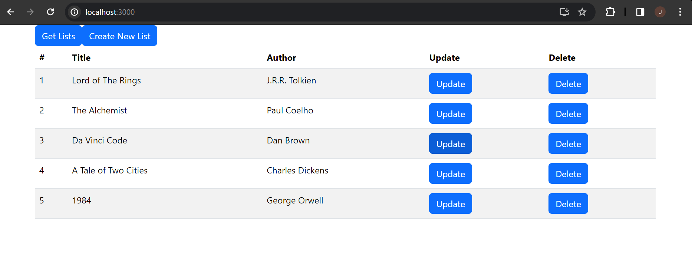
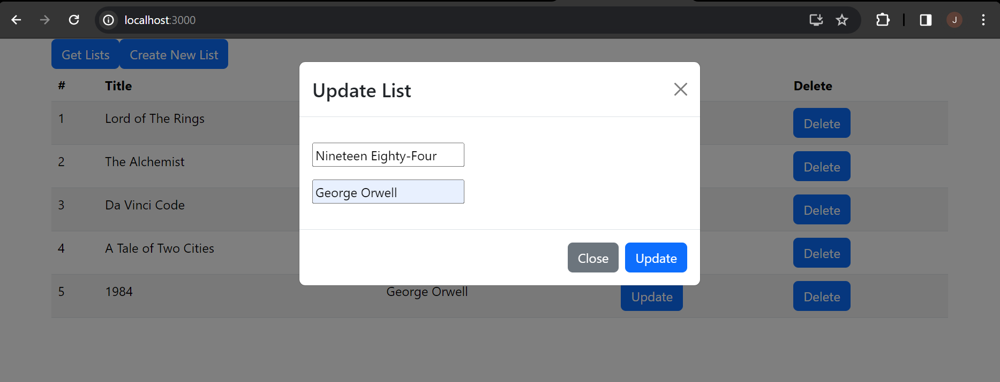
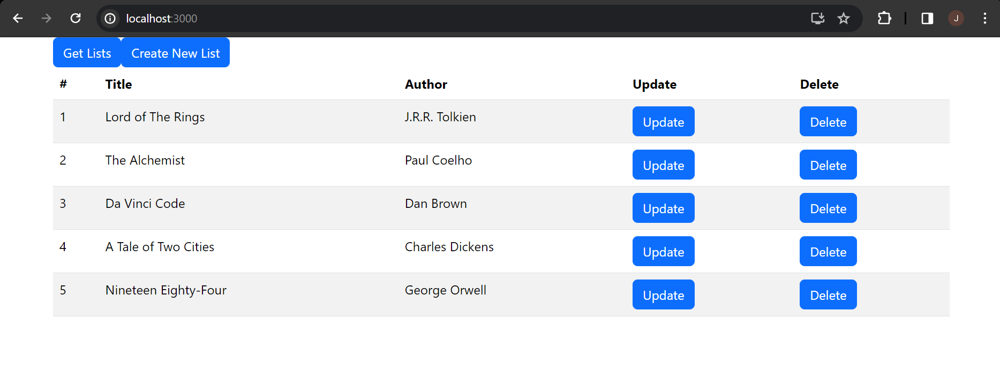
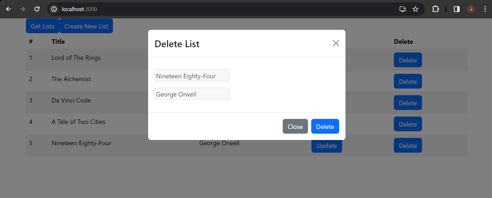

# web603-hw-w3d2

## Getting started

### Step 1: Duplicate Week-3 Day-2 Demo

Recap of Main steps:

- Create the application:
```bash
$ npx create-react-app crud-json-server
```

- Install dev-dependencies (`--save-dev` or `-D`), `json-server` and `concurrently`:
```bash
$ npm i -D json-server concurrently
```

- Install Bootstrap:
```bash
$ npm install bootstrap
```

- Duplicate other files in the repository `web603-class-w3d2`.

### Step 2: Check the Application

Start the application by
```bash
$ npm run dev
```

Click the button "Get Lists", you should be able to see data.



## Testing the Completed Application

### 1. New Homepage



### 2. Create List

After clicking the "Create New List" button on the home page:



After providing input and then clicking the "Create" button on the modal:



### 3. Update List

After clicking the "Update" button for a specific item:



After providing input and then clicking the "Update" button on the modal:



### 4. Delete List

After clicking the "Delete" button for a specific item:



After providing input and then clicking the "Create" button on the modal:


